The 2022 Google CTF featured a task in which contestants were asked to train an
artificial neural network that can classify images containing handwritten
characters. While optical character recognition is generally considered a
“solved” problem, this specific task had additional constraints that made it
more challenging to tackle.

In this post, I will present my solution to the task at hand.

### The Problem

The goal was to train a 2-layer MLP that takes in a 16x16x3 RGB image and
outputs a probability distribution over ASCII symbols (128 in total), indicating
the model’s confidence in which symbol is depicted in the image. The hidden
layer in the network has a size of 4 and is followed by the ReLU activation
function. The probability distribution is computed with softmax function.

In PyTorch, you could write this model as follows:

```py
import torch
import torch.nn.functional as F

class Model(torch.nn.Module):
  def __init__(self):
    super().__init__()
    self.linear1 = torch.nn.Linear(16 * 16 * 3, 4)
    self.linear2 = torch.nn.Linear(4, 128)

  def forward(self, x):
    x = x / 255
    x = torch.flatten(x, start_dim=1)
    x = self.linear1(x)
    x = F.relu(x)
    x = self.linear2(x)
    x = F.softmax(x, dim=-1)
    return x
```

Four images containing the symbols C, T, F, and { were given as training
examples:

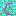 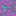 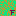 

After training the neural network, you evaluate it on a remote server. Upon
connecting to the server, you first send your parameters for the network. After
the parameters have been set, you can prompt the server to use the network to
classify symbols on a sequence of 34 images stored on the server.

These 34 images contain the flag for the challenge. The server runs each image
through the network and responds with the character in which the neural network
was most confident for every image. Additionally, if all the predictions were
correct, the server lets you know that you have successfully decoded the flag
and can submit it on the Google CTF website.

For those interested, I have included the code for the remote server in the
following spoiler.

<details>
  <summary>Server code</summary>

```py
# Copyright 2022 Google LLC
#
# Licensed under the Apache License, Version 2.0 (the "License");
# you may not use this file except in compliance with the License.
# You may obtain a copy of the License at
#
#     https://www.apache.org/licenses/LICENSE-2.0
#
# Unless required by applicable law or agreed to in writing, software
# distributed under the License is distributed on an "AS IS" BASIS,
# WITHOUT WARRANTIES OR CONDITIONS OF ANY KIND, either express or implied.
# See the License for the specific language governing permissions and
# limitations under the License.

import numpy as np
import sys
import glob
import string
import tensorflow as tf
from keras.models import Sequential
from keras.layers.core import Dense, Flatten
from flag import flag
import signal

signal.alarm(120)

tf.compat.v1.disable_eager_execution()

image_data = []
for f in sorted(glob.glob("images/*.png")):
    im = tf.keras.preprocessing.image.load_img(
        f, grayscale=False, color_mode="rgb", target_size=None, interpolation="nearest"
    )
    im = tf.keras.preprocessing.image.img_to_array(im)
    im = im.astype("float32") / 255
    image_data.append(im)

image_data = np.array(image_data, "float32")

# The network is pretty tiny, as it has to run on a potato.
model = Sequential()
model.add(Flatten(input_shape=(16,16,3)))
# I'm sure we can compress it all down to four numbers.
model.add(Dense(4, activation='relu'))
model.add(Dense(128, activation='softmax'))

print("Train this neural network so it can read text!")

wt = model.get_weights()
while True:
    print("Menu:")
    print("0. Clear weights")
    print("1. Set weight")
    print("2. Read flag")
    print("3. Quit")
    inp = int(input())
    if inp == 0:
        wt[0].fill(0)
        wt[1].fill(0)
        wt[2].fill(0)
        wt[3].fill(0)
        model.set_weights(wt)
    elif inp == 1:
        print("Type layer index, weight index(es), and weight value:")
        inp = input().split()
        value = float(inp[-1])
        idx = [int(c) for c in inp[:-1]]
        wt[idx[0]][tuple(idx[1:])] = value
        model.set_weights(wt)
    elif inp == 2:
        results = model.predict(image_data)
        s = ""
        for row in results:
            k = "?"
            for i, v in enumerate(row):
                if v > 0.5:
                    k = chr(i)
            s += k
        print("The neural network sees:", repr(s))
        if s == flag:
            print("And that is the correct flag!")
    else:
        break
```

</details>

### Solution Attempt #1

One way to solve this challenge would be to train a neural network in a
supervised setting, by providing labeled examples of handwritten characters to
the network.

There are two obstacles that make training the network in such a way difficult:

1. The network is extremely small.
2. There are only four training examples.

We cannot do much about the first complication, as the architecture of the
network is fixed. About the second one – we could try to get more training data
on our own. For example, we could create our own dataset based on an existing
character dataset (such as [EMNIST][emnist]) that manipulates the images to look
more similar to the four provided examples, e.g., by adding a background color
to characters.

[emnist]: https://www.nist.gov/itl/products-and-services/emnist-dataset

I tried training the neural network in the described way. The result was that
the model underfitted even when using very little training data, hinting that it
is too small to be used for optical character recognition.

### Solution Attempt #2

Considering the discussion from the previous section, it seems like training a
neural network of such size to classify symbols on images is impractical. But
what if we optimized the neural network to perform some task other than
character classification?

There is, in fact, one simple task that our tiny network is capable of learning
that helps us solve this challenge. That task is copying over the value from a
specific position in the image in a specific color channel. To wit, if we
represent an image as a 768-element array of 8-bit unsigned integers, the model
can learn to output the value stored at index \\( i \\).

Later, it turns out that with some simple rearrangements, we can use one set of
parameters to copy over the value from any location in the image array, not just
at some specific index \\( i \\). This means that if we wanted to copy over all
768 values, instead of having to train 768 networks, each one focusing on a
specific index, we would only need to train one.

If we trained a network to perform the previously described copy-over task, we
could use it to extract the 34 secret images from the server and decode the flag
manually, using our biological neural networks 🙂. The rest of this section
describes the training process for the said task and an algorithm that utilizes
the network to extract images from the server.

Let’s see how we can train the neural network to copy the values from its input
to its output. As there is no difference between copying over values from
different positions, let’s assume for now that our input consists of only 1
number.

The first step is redefining the meaning of the output. Recall that the output
consists of 128 units and that the server outputs a character whose ASCII code
was assigned the highest probability. As every element in the image array has a
value between 0 and 255, we can define a mapping between the ASCII symbols and
the numbers 0–255 as follows:

| ASCII code | Matching numbers |
| ---------- | ---------------- |
| 0          | 0, 1             |
| 1          | 2, 3             |
| 2          | 4, 5             |
| 3          | 6, 7             |
| 4          | 8, 9             |
| ...        | ...              |
| 127        | 254, 255         |

For example, if the value at currently focused location is 7, then the network
should assign a high probability to class 3.

The second step involves training the model to act according to our new desired
output function. The training data consists of integers from 0 to 255, and as
the objective function, we can use cross entropy. The following code snippet
initializes a model and trains it.

```py
import torch
import torch.nn.functional as F

torch.manual_seed(0)

class Model(torch.nn.Module):
  def __init__(self):
    super().__init__()
    self.linear1 = torch.nn.Linear(1, 4)
    self.linear2 = torch.nn.Linear(4, 128)

  def forward(self, x):
    x = x / 255
    x = self.linear1(x)
    x = F.relu(x)
    x = self.linear2(x)
    return x

model = Model()
optimizer = torch.optim.Adam(model.parameters(), lr=0.1)

for i in range(200):
    optimizer.zero_grad()

    inputs = torch.arange(256).float()
    targets = (inputs / 2).long()

    logits = model(inputs.unsqueeze(1))
    loss = F.cross_entropy(logits, targets)

    loss.backward()
    optimizer.step()

    with torch.no_grad():
        predictions = torch.argmax(logits, dim=-1) * 2
        mae = F.l1_loss(predictions.float(), inputs.float())

    print(f"iteration {i}, loss {loss.item():.3f}, mean absolute error {mae.item():.3f}")

model.linear2.weight = torch.nn.Parameter(model.linear2.weight * 1000)
model.linear2.bias = torch.nn.Parameter(model.linear2.bias * 1000)
```

It should take around two seconds to train the network. It should reach a mean
absolute error of around 2, which is good enough for our purposes.

Note that after the training is complete, the parameters of the last layer are
multiplied by 1000. That step is necessary because the remote server only emits
the most probable character when its probability is higher than 0.5. However,
the network often does not give that high a probability, and the bulk of
probability mass is distributed between several classes.

To ensure that the neural network gives high confidence to one class, we apply
softmax temperature of \\( \frac{1}{1000} \\). Usually, the temperature is
applied during inference by dividing the logits by the temperature, but we will
instead encode the temperature in the weights themselves because we cannot alter
the code that the remote server is running.

One question I have not yet addressed is why we do not need to train a separate
network for every index in the image array?

We currently trained a network with an input size of 1, leading to a 1x4 weights
vector \\( \boldsymbol{w}' \\) in the first layer. If we later want to use the
same network for an input size of 768, we initialize the weight matrix \\(
\boldsymbol{W} \\) of size 768x4 to a zero matrix. To make the network focus on
index \\( i \\), we set the values in the i’th row in the matrix to vector \\(
\boldsymbol{w}' \\). Then, the rest of the values besides the one at \\( i \\)
do not contribute to the layer’s output, as they are all multiplied by zeros.
But the value of the element at index \\( i \\) is still multiplied by the same
coefficients as in the case where the model only had one input.

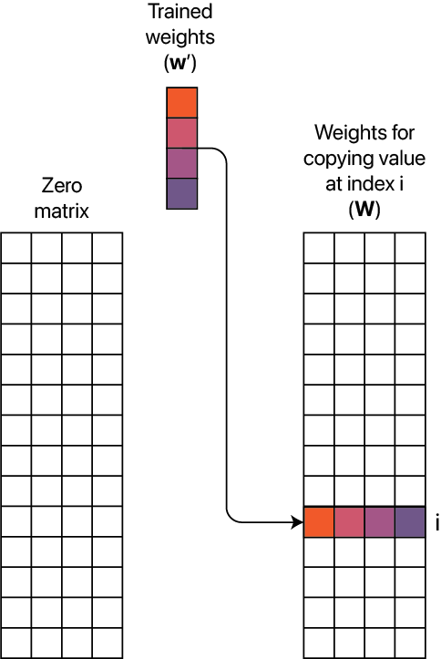

Once the network has been trained, the next step is using it to extract images
from the server. I will outline the general algorithm for extracting the images.
But before we get to the algorithm, I will give a brief overview of the commands
used for interacting with the server, as these commands are referenced in the
algorithm.

**The commands**

1. Set all parameters to 0.
2. Set the value of a single parameter to \\( x \\) at index \\( i \\) in
   parameter tensor \\( j \in \\{0, 1, 2, 3\\} \\). \\( j \\) specifies which
   parameter tensor should be changed. There are four tensors in total: 1 –
   weights for layer 1, 2 – biases for layer 1, 3 – weights for layer 2, 4 –
   biases for layer 2.
3. Read the flag. The server responds with a string, containing predictions for
   all 34 images.

**Image extraction algorithm**

- Initialize a 34x768 matrix \\( \boldsymbol{o} \\) to store the (partially)
  extracted images from the server.
- Set all parameters to 0 using command 1.
- Using command 2, copy all parameters from the trained network except the
  weights matrix from the first layer.
- for \\( i = 0 \\: \textrm{to} \\: 767 \\)
  - Using command 2, set the weights in the first layer at indices \\( (i, 0),
    (i, 1), (i, 2), (i, 3) \\) to the values of the weights of the trained
    network’s first layer.
  - Read the flag, convert the returned symbols to their ASCII codes, and
    multiply the resulting numbers by two. Set column \\( i \\) in matrix \\(
    \boldsymbol{o} \\) to the obtained numbers.
  - Using command 2, set the weights in the first layer at indices \\( (i, 0),
    (i, 1), (i, 2), (i, 3) \\) to 0.
- Convert each of the rows in matrix \\( \boldsymbol{o} \\) to 16x16x3 RGB
  images using a library of your choice.
- Save the images to disk.
- Decode the flag from the images.

The images extracted from the server should look as follows:

<!-- prettier-ignore -->

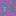


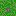

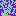
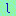
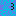
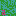
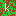
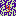
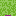

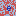
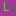
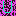
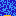
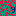
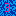
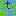
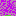


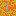
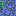
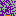
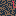
 
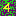
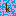

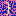

From the images we can see that the flag is
**CTF{n0_l3aky_ReLU_y3t_5till_le4ky}**.

### Alternative Solution

The solution I introduced in the previous section was the one I came up with
during the competition. After the competition, I found some
[write-ups][other-writeup] for the same challenge that used slightly different
approaches. While the core idea stayed the same – extracting the images from the
server and decoding the flag manually, there were several ways to extract the
images.

[other-writeup]: https://sigflag.at/blog/2022/google_ctf_2022_ocr/

One alternative was to determine the values using binary search. Let’s denote
the neural network as follows:

\\[ f(\boldsymbol{x}) = \textrm{softmax}(\textrm{ReLU}(\boldsymbol{x} \cdot
\boldsymbol{W} + \boldsymbol{b}) \cdot \boldsymbol{V} + \boldsymbol{c}) \\]

Here, \\( \boldsymbol{W} \\), \\( \boldsymbol{b} \\), \\( \boldsymbol{V} \\),
and \\( \boldsymbol{c} \\) are parameters of the network.

Let’s denote the index of the array that we are focusing on as \\( i \\).

To perform binary search, we initialize the parameters as follows:

- Let \\( \boldsymbol{W} \\) be zero matrix with the exception that \\( w\_{i1}
  = 255 \\).
- Let \\( \boldsymbol{b} \\) be a zero vector.
- Let \\( \boldsymbol{V} \\) be a zero matrix with the exception that \\(
  v\_{11} = 10 \\).
- Let \\( \boldsymbol{c} \\) be a zero vector.

The weight \\( w\_{i1} \\) is set to 255 because before the image is fed to the
model, it is divided by 255. We reverse that operation by multiplying the input
with 255.

The binary search algorithm works as follows:

- Initially, we know that the value at \\( i \\) is in the range \[0, 255\].
  Let’s set \\( b_1 = -128 \\) and read the flag. The output of the neural
  network before softmax is applied will be all zeros except at \\( y_1 \\)
  where it will be

  <!-- prettier-ignore -->
  \\[ y_1 =
  \textrm{ReLU}(x_i \cdot w_{i1} + b_1) \cdot v\_{11} + c_1 =
  \textrm{ReLU}(x_i \cdot 255 - 128) \cdot 10
  \\]

  Note that if the value at \\( i \\) is larger than 128, the neural network
  will assign a positive value the first class. This means that the server would
  return a zero-byte, as applying softmax would shift most of the probability
  mass towards the first class.

  If the value at \\( i\\) is less than 128, then \\( y_1 = 0 \\). It follows
  that the input to softmax would then only consist of zeros which leads to an
  uniform distribution after applying softmax and the server would return a ?
  symbol, as none of the classes would have had a probability higher than 0.5.
  Based on the returned value from the server, we can induce whether the value
  is in the half-interval \[0, 128) or the interval \[128, 255\].

* We have now performed the first iteration of binary search and have shrunk the
  size of the set of potential values by a factor of 2.

  We can perform another interation to get a more accurate reading. If during
  the previous step the value was found to be in \[0, 128), we can set \\( b_1 =
  -64 \\) to determine if the value is in \[0, 64) or \[64, 128). If during
  previous step we found that the value was in \[128, 255\], then we can set \\(
  b_1 = -128 - 64 = -192 \\) to determine if the value is in \[128, 192) or
  \[192, 255\].

* We could continue the search for a few more steps, but it turns out that just
  two steps of binary search gives us high enough accuracy to decode the flag
  from the images.

Here are the same 34 images from the server when decoded using the binary search
approach.

<!-- prettier-ignore -->


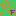

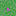

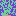
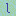
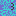
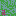
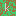
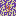
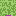

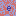
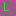
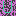
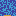
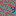
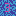
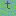
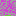
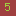
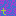
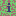
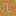
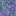


